# Aleksandar Nikolic

  <b>Building practical apps, clean UI, and fun developer experiences.</b>

  <a href="https://github.com/Aleksandros2">GitHub</a> |
  <a href="https://github.com/Aleksandros2?tab=repositories">Projects</a>

---

## Arcade Contribution Arena

Custom contribution animation (snake-free): a retro gorilla throws barrels at your active contribution blocks.

---

## About me

- Student developer from Switzerland
- Interested in practical apps, automation, and clean UI
- Improving portfolio and GitHub projects continuously

## Tech stack

`Python` `C#` `HTML` `CSS` `JavaScript` `SQL`

## How this works

- The SVG is generated by `scripts/generate_arcade_contrib.py`
- GitHub Actions runs daily and updates `assets/arcade-contrib.svg`
- Workflow file: `.github/workflows/arcade-contributions.yml`
